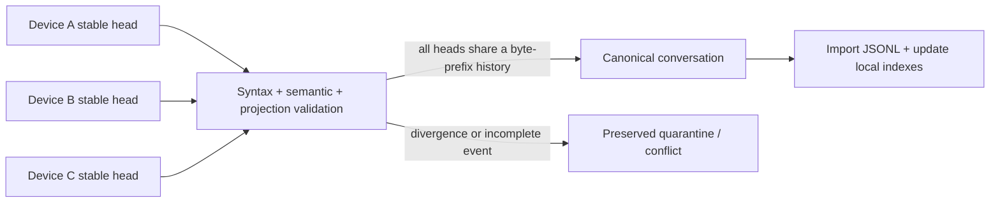

# Codex Sync

**English** | [简体中文](README.zh-CN.md)

Codex task history lives on one machine. **Codex Sync2 gives multi-device Codex users a recoverable synchronization layer for selected tasks and personal skills—without copying credentials, live databases, or unfinished turns.**

Built for developers who move between Windows and macOS and need the same trusted Codex context on every device.

```text
$ sync2 conversation select current
Selected: Example task

$ sync2 sync
conversationsPushed: 1   conversationConflicts: 0

$ sync2 doctor
ok: true
```

## Why Sync2 exists

Copying `~/.codex` is unsafe: it mixes credentials, device identity, live SQLite state, caches, and partially written turns. Generic file synchronization does not understand which Codex events form a complete conversation.

Sync2 adds that missing semantic layer:

- select only the tasks worth carrying between devices;
- publish only complete JSONL and stable, closed turns;
- keep independent device heads and promote a canonical history only when they are byte-prefix compatible;
- quarantine incomplete or divergent history instead of inventing a merge;
- synchronize personal skill collections with three-way hashes and preserved conflict copies;
- update local Codex indexes without copying another device's database.

## Quick start

Requirements: Node.js 22+, Codex initialized once on each device, and a trusted shared folder or checked-out private Git vault.

Install as a Codex skill:

```sh
git clone <repository-url> codex-sync2
mkdir -p "$HOME/.codex/skills/sync2"
cp -R codex-sync2/. "$HOME/.codex/skills/sync2/"
```

Initialize one device:

```sh
node "$HOME/.codex/skills/sync2/scripts/sync2.mjs" init \
  --vault "$HOME/Sync2Vault" \
  --transport folder \
  --device mac-main
```

Then invoke `$sync2 current` inside the Codex task you want to preserve. Run `$sync2 doctor` before enabling automatic scheduling.

Windows and macOS cold-start commands are in the [deployment guide](references/deployment.md).

> **Security note:** the operational vault stores selected conversation text and user skill source in plaintext. Sync2 never copies credentials or complete Codex databases. Use only storage and peers you trust; see [Security and privacy](SECURITY.md).

## How it works



Syncthing or private Git transports bytes. Sync2 decides which bytes are a safe Codex conversation. Read the [architecture](docs/architecture.md) and [protocol](references/protocol.md) for the invariants.

## Evidence that it works

```sh
npm run check
```

The deterministic suite runs 65 checks across folder and Git transports, interrupted-event recovery, legacy abort repair, stable active checkpoints, conflict preservation, Windows extended paths, desktop catalog updates, maintenance mode, device reports, and skill reconciliation.

GitHub Actions runs the same privacy gate and tests on Windows, macOS, and Linux with Node.js 22. The fixtures use isolated temporary Codex homes and synthetic conversations; they never read the user's real vault.

## Data boundaries

Included:

- explicitly selected rollout JSONL;
- portable task metadata;
- user-defined skill files;
- device selection events and health reports.

Excluded:

- `auth.json`, tokens, API keys, installation and device credentials;
- `config.toml`, complete SQLite/WAL databases, logs, caches, and models;
- attachments and generated images;
- system and plugin-managed skill caches;
- arbitrary project content unless registered separately.

## Limitations

- Conversation attachments are not copied.
- Independently continuing the same task while devices are disconnected creates an explicit conflict requiring a human choice.
- Sync2 does not encrypt the vault itself.
- Older Sync2 clients do not understand maintenance mode; disable their schedulers before a fleet upgrade.
- Codex storage formats may evolve; run `doctor` and the test suite after Codex upgrades.

## Documentation

- [Demonstration](docs/demo.md)
- [Architecture](docs/architecture.md)
- [Usage guide](references/usage.md)
- [Deployment and cold start](references/deployment.md)
- [Protocol and recovery](references/protocol.md)
- [Roadmap](docs/roadmap.md)
- [Security policy](SECURITY.md)
- [Contributing](CONTRIBUTING.md)

## Project status

Sync2 is an early, tested engineering project. The current release is intended for users comfortable inspecting local files, backups, and synchronization health. Safety and recoverability take priority over automatic conflict resolution.

## License

MIT. See [LICENSE](LICENSE).
