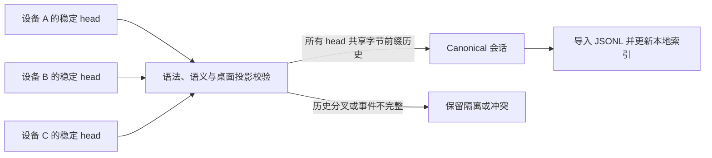

# Codex Sync2

[English](README.md) | **简体中文**

Codex 的任务历史通常只保存在当前电脑。**Codex Sync2 为跨 Windows 与 macOS 使用 Codex 的开发者提供可恢复的选定任务与个人 Skill 同步层，同时避免复制凭据、运行中的数据库或尚未完成的回合。**

它适合需要在多台设备上继续使用同一份可信 Codex 上下文的开发者。

```text
$ sync2 conversation select current
Selected: Example task

$ sync2 sync
conversationsPushed: 1   conversationConflicts: 0

$ sync2 doctor
ok: true
```

## 为什么需要 Sync2

直接复制 `~/.codex` 并不安全：其中混合了凭据、设备身份、正在写入的 SQLite 状态、缓存和未完成回合。普通文件同步工具也不知道哪些 Codex 事件才能构成完整会话。

Sync2 补上了这一层语义安全能力：

- 只选择真正需要跨设备保留的任务；
- 只发布完整 JSONL 和稳定、已关闭的回合；
- 为每台设备保留独立 head，仅在历史满足字节前缀关系时提升 canonical；
- 隔离不完整或分叉历史，而不是虚构合并结果；
- 通过三方哈希同步个人 Skill，并保留冲突副本；
- 更新本地 Codex 索引，而不是复制其他设备的数据库。

## 快速开始

要求：Node.js 22+、每台设备至少启动过一次 Codex，以及一个可信共享文件夹或已检出的私有 Git vault。

安装为 Codex Skill：

```sh
git clone <repository-url> codex-sync2
mkdir -p "$HOME/.codex/skills/sync2"
cp -R codex-sync2/. "$HOME/.codex/skills/sync2/"
```

初始化一台设备：

```sh
node "$HOME/.codex/skills/sync2/scripts/sync2.mjs" init \
  --vault "$HOME/Sync2Vault" \
  --transport folder \
  --device mac-main
```

随后在需要保留的 Codex 任务中调用 `$sync2 current`。启用自动调度前先运行 `$sync2 doctor`。

Windows 与 macOS 的冷启动命令见[部署指南](references/deployment.md)。

> **安全提示：**实际运行的 vault 会以明文保存已选择的会话文本与用户 Skill 源码。Sync2 不会复制凭据或完整 Codex 数据库。请只使用你信任的存储与对等设备；详见[安全与隐私](SECURITY.zh-CN.md)。

## 工作原理



Syncthing 或私有 Git 负责传输字节；Sync2 负责判断哪些字节构成安全的 Codex 会话。关键约束见[架构说明](docs/architecture.zh-CN.md)与[协议文档](references/protocol.md)。

## 可验证的工程证据

```sh
npm run check
```

确定性测试套件包含 65 项检查，覆盖文件夹与 Git 传输、中断事件恢复、旧式 abort 修复、活动回合稳定检查点、冲突保留、Windows 扩展路径、桌面目录更新、维护模式、设备报告和 Skill 同步。

GitHub Actions 在 Windows、macOS 和 Linux 的 Node.js 22 环境中运行同一套隐私 gate 与测试。测试使用隔离的临时 Codex home 和合成会话，不读取用户的真实 vault。

## 数据边界

包含：

- 明确选择的 rollout JSONL；
- 可移植任务元数据；
- 用户自定义 Skill 文件；
- 设备选择事件与健康报告。

排除：

- `auth.json`、token、API key、安装和设备凭据；
- `config.toml`、完整 SQLite/WAL 数据库、日志、缓存和模型；
- 附件与生成图片；
- 系统和插件管理的 Skill 缓存；
- 未单独注册的任意项目内容。

## 限制

- 不复制会话附件。
- 设备离线期间若在多端独立继续同一任务，会产生需要人工选择的显式冲突。
- Sync2 本身不加密 vault。
- 旧版 Sync2 不理解维护模式；升级整个设备集前必须禁用旧调度器。
- Codex 存储格式可能变化；Codex 升级后应运行 `doctor` 与测试套件。

## 文档

- [演示](docs/demo.zh-CN.md)
- [架构](docs/architecture.zh-CN.md)
- [使用指南（英文）](references/usage.md)
- [部署与冷启动（英文）](references/deployment.md)
- [协议与恢复（英文）](references/protocol.md)
- [路线图](docs/roadmap.zh-CN.md)
- [安全策略](SECURITY.zh-CN.md)
- [贡献指南](CONTRIBUTING.zh-CN.md)

## 项目状态

Sync2 是一个处于早期阶段、但已有完整测试的工程项目。目前版本面向愿意检查本地文件、备份与同步健康状态的用户。安全与可恢复性优先于自动冲突合并。

## 许可证

MIT，详见 [LICENSE](LICENSE)。
