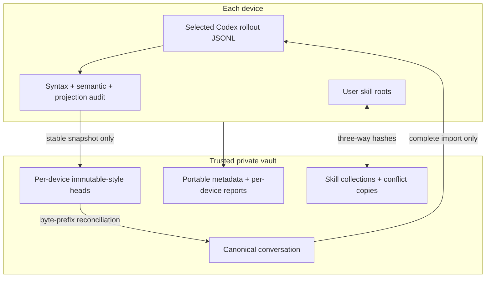

# Architecture

**English** | [简体中文](architecture.zh-CN.md)

## Responsibility split

Codex Sync deliberately separates transport from conversation correctness.

- **Syncthing/shared folders/private Git** move files between machines.
- **Codex Sync** validates event completeness, reconciles histories, and updates local Codex indexes.
- **Codex** remains the only writer of live task activity; Codex Sync never exports the active turn.

## Conversation invariants

1. JSONL is treated as append-only.
2. Every tool or function call needs a matching output.
3. Every older turn needs a completion or projection-compatible interruption.
4. The active turn is excluded from publication.
5. Healthy heads must share a byte-prefix relationship.
6. Divergent histories are preserved for explicit human resolution.
7. Complete Codex databases, credentials, logs, and caches never enter the vault.

## Failure containment

- An incomplete conversation is quarantined while independent skills and projects continue synchronizing.
- Maintenance mode blocks ordinary writes during repair or fleet migration.
- Repairs append explicit recovery records and create local backups; they do not reconstruct unknown tool output.
- Device reports expose protocol version, script hash, local/vault health, scheduler state, and the result of the run that produced the report.

For exact reconciliation behavior and recovery commands, read [the protocol guide](../references/protocol.md).
