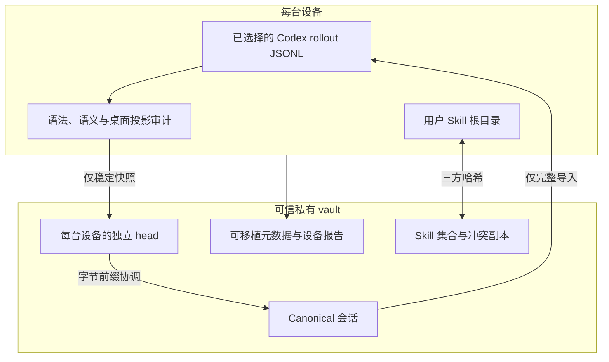

# 架构

[English](architecture.md) | **简体中文**

## 职责拆分

Codex Sync 明确区分“文件传输”和“会话正确性”。

- **Syncthing、共享文件夹或私有 Git** 负责在机器间移动文件。
- **Codex Sync** 负责校验事件完整性、协调历史并更新本地 Codex 索引。
- **Codex** 仍是实时任务活动的唯一写入方；Codex Sync 永远不导出活动回合。

## 会话约束

1. 将 JSONL 视为只追加历史。
2. 每个工具或函数调用都必须有匹配输出。
3. 每个较早回合都必须完成或拥有桌面投影兼容的中断事件。
4. 发布时排除活动回合。
5. 健康 head 必须共享字节前缀关系。
6. 分叉历史必须保留，等待人工显式选择。
7. 完整 Codex 数据库、凭据、日志和缓存不得进入 vault。

## 故障隔离

- 不完整会话会被隔离，但独立的 Skill 和项目仍可继续同步。
- 维护模式会在修复或设备集迁移期间阻止普通写入。
- 修复操作追加显式恢复记录并创建本地备份，不会重构未知工具输出。
- 设备报告公开协议版本、脚本哈希、本地与 vault 健康状态、调度器状态，以及生成该报告的同一轮运行结果。

精确的协调行为与恢复命令见[协议指南（英文）](../references/protocol.md)。
